# 传感器采集与 OLED 程序完整流程

本文件对应当前拨码切页版本，覆盖 `software/Core` 的 STM32 固件、`software/Common/display_link.h` 共用协议，以及 `software/esp32_oled` 的 ESP32 显示固件。图使用 Mermaid，在支持 Mermaid 的 Markdown 阅读器中可直接显示。寄存器值、公式和分支均按本仓库实现整理。

`test/wifi_test`、`test/hello_world` 是独立实验工程，不参与当前固件运行。当前程序有六轴姿态解算、手机 Wi-Fi 控制链和四路同油门电调输出；没有姿态混控或 OTA 运行链路。

## 1. 整体数据流与接线

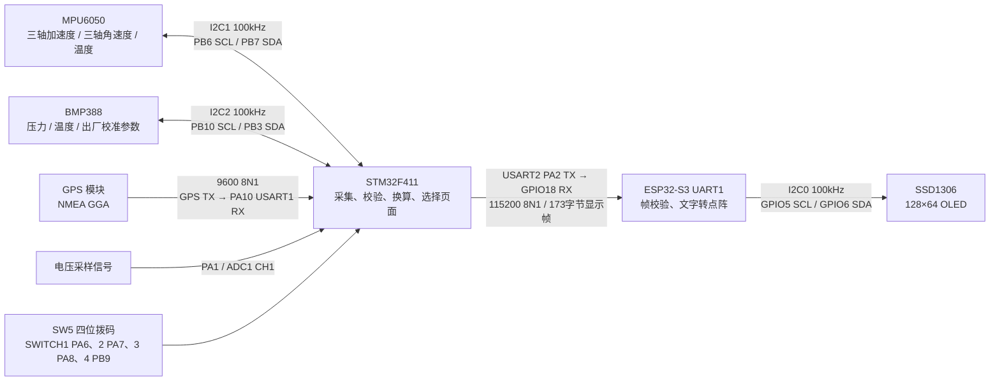

| 通信 | 配置 | 当前软件的实际行为 |
| --- | --- | --- |
| MPU6050 | 7 位地址 `0x68` 或 `0x69` | STM32 主动读写寄存器，轮询数据就绪；不使用 MPU_INT 中断采样 |
| BMP388 | 7 位地址 `0x76` 或 `0x77` | STM32 主动读取校准系数、状态和原始数据 |
| GPS USART1 | PA9 TX / PA10 RX，9600 baud，8N1，无流控，16 倍过采样 | 只接收模块主动输出的 GGA，不发送模块配置命令 |
| STM32→ESP32 | PA2 TX→GPIO18 RX，115200 baud，8N1，无流控 | 只发送当前页面文字，无应答、序号或逐帧重传 |
| 手机控制串口 | ESP32 GPIO17 TX→STM32 PA3 RX，115200 baud，8N1 | 接收 QCTRL v1 控制帧并校验 CRC |
| OLED | `0x3C` 或 `0x3D`，100kHz | ESP32 主动写命令及像素；没有读取屏幕内容或芯片 ID |

STM32 的 I²C HAL 接口接收的是左移一位后的地址：`7位地址 << 1`；ESP-IDF 的 OLED 接口使用原始 7 位地址。两者不能直接混用。

## 2. STM32 从复位到主循环

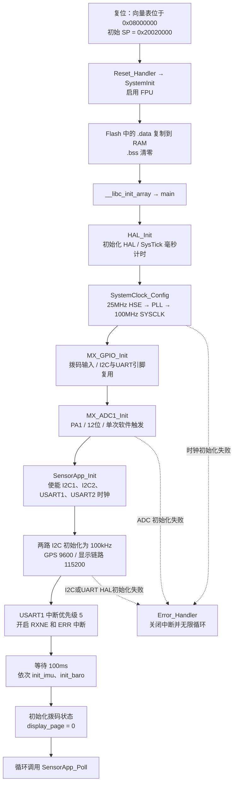

GCC 启动实现见 [startup_stm32f411xe.S](../GCC/startup_stm32f411xe.S)，时钟与 GPIO 见 [main.c](../Core/Src/main.c)。PLL 参数为 M=12、N=96、P=2，AHB=100MHz、APB1=50MHz、APB2=100MHz。TIM3 使用100MHz计时器时钟，启动四路50Hz电调 PWM。

传感器不存在或不应答不会进入 `Error_Handler`：只标记该传感器不可用，进入主循环继续服务其他设备。上述硬件外设 HAL 初始化失败才是致命错误。

## 3. STM32 主循环与调度

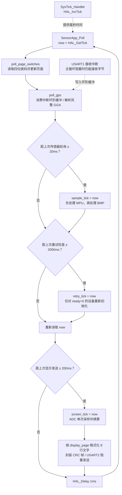

| 任务 | 时间设置 | 说明 |
| --- | --- | --- |
| 拨码扫描与 GPS 解析 | 每次主循环 | 没有独立任务线程；编码稳定30ms后生效 |
| MPU/BMP 状态轮询 | 间隔达到 20ms 时执行 | 有数据就读，没有就绪则保留上次值 |
| 传感器重试 | 每 2000ms 检查一次 | 共用重试时间戳，并非每颗设备从报错时刻单独倒计时 |
| ADC / 显示发送 | 间隔达到 200ms 时执行 | 无论当前哪页，都会采 ADC |
| 主循环末尾 | 延时 1ms | 不是整个主循环仅耗时 1ms |

这些间隔是“达到阈值后执行”，不是实时定时器保证的精确周期。I²C 阻塞读写、串口发送、设备初始化延时都会延后下一次循环。拨码切页也要等后续显示发送及 ESP32 绘制，并非 GPIO 变化后立即上屏。

## 4. I²C 寄存器通信的字节过程

`read_reg` / `write_reg` 使用 STM32 HAL 阻塞存储器读写，寄存器地址宽度为 8 位，传入超时参数 20ms。下面是成功交易的总线顺序，HAL 内部等待和错误路径可能另有固定等待，20ms 不代表整个主循环的最坏耗时。

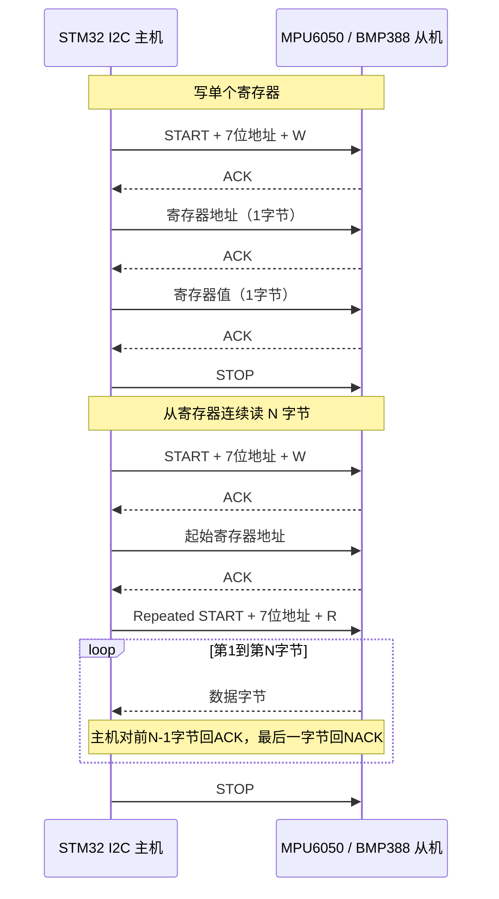

软件把 `HAL_OK` 视为成功；NACK、总线错误或超时最终表现为失败。当前没有软件 SCL 脉冲解锁总线的逻辑。

## 5. MPU6050：初始化、采样与换算

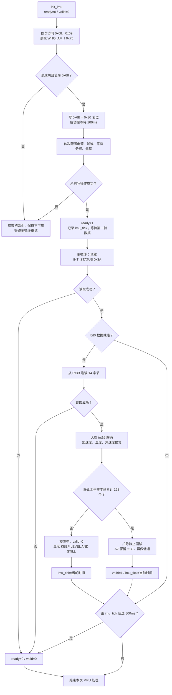

复位写失败同样直接返回不可用。配置写使用短路 `&&`，某一步失败后不继续后面的配置写。

| 顺序 | 寄存器 | 写入值 | 配置作用 |
| --- | --- | --- | --- |
| 1 | `0x6B PWR_MGMT_1` | `0x01` | 唤醒，选择 PLL 时钟 |
| 2 | `0x6C PWR_MGMT_2` | `0x00` | 启用全部轴 |
| 3 | `0x1A CONFIG` | `0x03` | DLPF：加速度约 44Hz / 陀螺仪约 42Hz |
| 4 | `0x19 SMPLRT_DIV` | `19` | 1kHz / (19+1) = 50Hz |
| 5 | `0x1B GYRO_CONFIG` | `0x00` | ±250°/s，131 LSB/(°/s) |
| 6 | `0x1C ACCEL_CONFIG` | `0x00` | ±2g，16384 LSB/g |

14 字节依次为 AX、AY、AZ、温度、GX、GY、GZ，每项 2 字节，高字节在前。解码与换算严格对应现有整数算法：

```text
u = (高字节 << 8) | 低字节
raw = u >= 32768 ? u - 65536 : u

acc[i]   = trunc(raw_acc[i] × 1000 / 16384)    // 单位 0.001 g
 gyro[i] = trunc(raw_gyro[i] × 100 / 131)      // 单位 0.01 °/s
imu_temp = trunc(raw_temp × 100 / 340) + 3653 // 单位 0.01 °C
```

这里 `trunc` 表示 C 整数除法向零截断。上电后用 128 个水平、稳定的有效样本建立静止零偏：AX/AY 与 GX/GY/GZ 扣除各自均值；AZ 扣除 `(均值 - ±1000mg)`，因此水平静止时仍显示约 ±1G。若样本波动过大或水平条件不满足，重新收集；之后偏移保持固定，再对显示读数进行 1/4 新样本的一阶低通。屏幕分别显示 3、2、2 位小数。陀螺仪静止偏移大于 20°/s 时，标题提示 `MPU BIAS HIGH`。姿态解算直接使用校准后的原速率样本，避免显示低通带来额外相位滞后。

姿态页的链路为：校准后的六轴数据 → 根据传感器 -X 指向机头、启动时 Z 轴重力符号变换到机体 X 前/Y 左/Z 上 → 根据实际采样时间间隔积分角速度四元数并归一化 → 当加速度合量在 0.8–1.2G 时，用重力方向误差修正横滚/俯仰 → 转成欧拉角，格式化为度。大加速度时跳过重力修正，避免把平移加速度误认成倾斜。启动时用重力确定横滚/俯仰并把航向设为相对零点；没有磁力计，因此航向可能随陀螺仪零偏漂移。输出符号为左侧抬起 ROLL 正、机头抬起 PITCH 正、向右转 YAW 正。采样间隔超过 100ms 时重新初始化姿态，避免长时间缺样后错误积分。

## 6. BMP388：初始化及读取流程

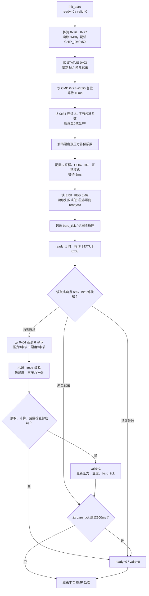

初始化中任何必要读写失败都不会发布有效数据；下一次 2 秒重试检查会重新执行初始化。校准字节校验只排除了全 0 / 全 FF，额外的结果合理性由补偿后的范围检查承担。

| 寄存器 | 值 | 当前配置 |
| --- | --- | --- |
| `0x1C OSR` | `0x03` | 压力 ×8，温度 ×1 |
| `0x1D ODR` | `0x03` | 25Hz |
| `0x1F CONFIG` | `0x04` | IIR 系数 3 |
| `0x1B PWR_CTRL` | `0x33` | 压力、温度使能，normal 模式 |

原始数据布局：`0x04..0x06` 为压力低/中/高字节，`0x07..0x09` 为温度低/中/高字节。

```text
raw_p = b0 | (b1 << 8) | (b2 << 16)
raw_t = b3 | (b4 << 8) | (b5 << 16)
```

## 7. BMP388：21 字节系数和完整补偿公式

源代码：[bmp388_math.c](../Core/Src/bmp388_math.c)。以下 `u16` 为小端无符号数，`s16` 为小端补码有符号数，`s8` 为有符号字节；偏移从读出的 21 字节数组起算。表中数组下标与代码一致，从 0 开始。

| 系数 | 字节偏移 | 原始类型 | 转换公式 |
| --- | --- | --- | --- |
| t[0] | 0–1 | u16 | raw × 2^8 |
| t[1] | 2–3 | u16 | raw / 2^30 |
| t[2] | 4 | s8 | raw / 2^48 |
| p[0] | 5–6 | s16 | (raw − 2^14) / 2^20 |
| p[1] | 7–8 | s16 | (raw − 2^14) / 2^29 |
| p[2] | 9 | s8 | raw / 2^32 |
| p[3] | 10 | s8 | raw / 2^37 |
| p[4] | 11–12 | u16 | raw × 2^3 |
| p[5] | 13–14 | u16 | raw / 2^6 |
| p[6] | 15 | s8 | raw / 2^8 |
| p[7] | 16 | s8 | raw / 2^15 |
| p[8] | 17–18 | s16 | raw / 2^48 |
| p[9] | 19 | s8 | raw / 2^48 |
| p[10] | 20 | s8 | raw / 2^65 |

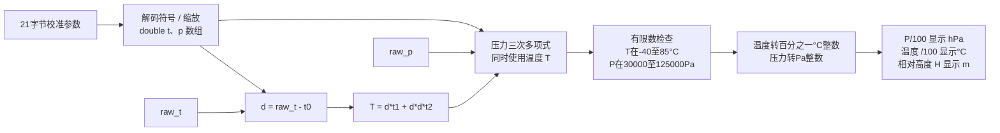

```text
d = raw_t − t[0]
T = d × t[1] + d² × t[2]
r = raw_p

P = p[4] + T × (p[5] + T × (p[6] + T × p[7]))
  + r × (p[0] + T × (p[1] + T × (p[2] + T × p[3])))
  + r² × (p[8] + T × p[9] + r × p[10])

若 T/P 不是有限数，或 T < -40，T > 85，P < 30000，P > 125000：失败。
温度整数 = trunc(T × 100 + (T < 0 ? -0.5 : 0.5))
压力整数 = trunc(P + 0.5)
```

所有补偿中间值使用 `double`。显示气压时以 100 为小数缩放系数，把 Pa 显示为 hPa，保留两位小数。压力先使用 1/8 新样本的一阶低通；上电后累计 32 个有效滤波压力样本求平均作为基准 `P0`，期间高度保持 0m。之后使用 `H=44330×(1-(P/P0)^0.190294957)` 计算相对高度，再使用 1/4 新样本的一阶低通，显示米并保留两位小数。滤波只抑制噪声，不对高度做死区或自动归零处理；基准只在本次上电周期内有效。MPU 和 ADC 也分别使用 1/4 新样本的一阶低通。

## 8. GPS：中断接收与主循环解析

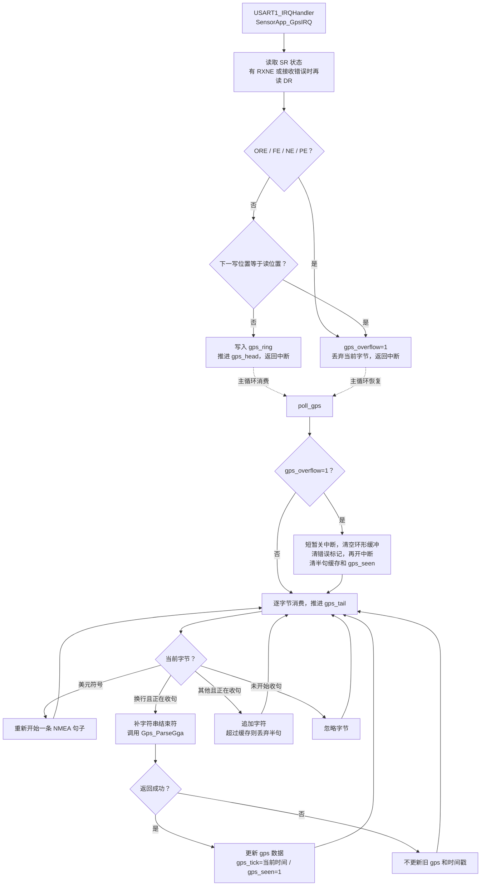

环形缓冲分配 1024 字节，使用“留一个空槽区分满/空”的方法，实际最大积压为 1023 字节。句子缓存 128 字节，最多存 127 个字符再加终止符。图中“逐字节消费”在缓冲为空时返回主循环，不会空转等待。中断只收字节，不进行字符串解析。

### GGA 校验和字段处理

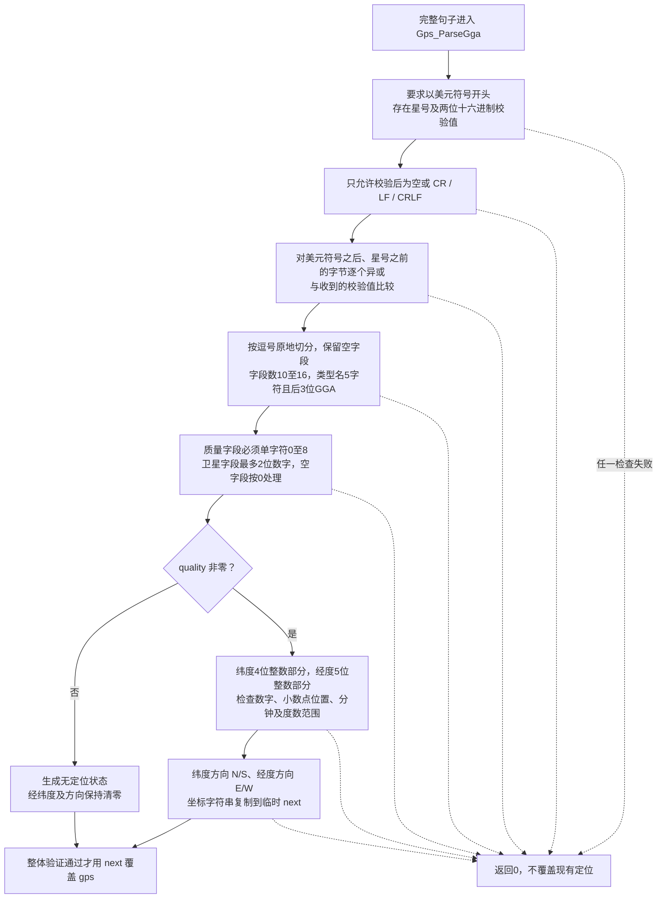

典型帧：

```text
$GPGGA,123519,4807.038,N,01131.000,E,1,08,0.9,545.4,M,46.9,M,,*47\r\n
          UTC    纬度  北纬   经度  东经 质量 卫星
```

字段按类型名为第 0 项计数：2=纬度、3=N/S、4=经度、5=E/W、6=质量、7=卫星数。UTC、HDOP、高度等没有保存或参与显示。代码接受任意两字符 talker 前缀，不仅 GP/GN；它不是完整 NMEA 语义验证器。

纬度范围到 90°，经度到 180°，分钟必须小于 60，达到最大度数时分钟必须为 0。坐标字符串长度小于 16。显示保留 `DDMM.MMMM` / `DDDMM.MMMM`，**没有转十进制度**。例如 `4807.038 N` 是北纬 48 度 7.038 分。

quality=0 的合法 GGA 也刷新接收时间，显示 `WAITING FOR FIX`。从未收到合法 GGA，或距最近合法 GGA 超过 3000ms，显示 `NO GGA / TIMEOUT`。非零质量均按当前实现显示坐标，没有进一步区分自主定位、差分、估算等质量含义。

## 9. ADC 与拨码页面选择

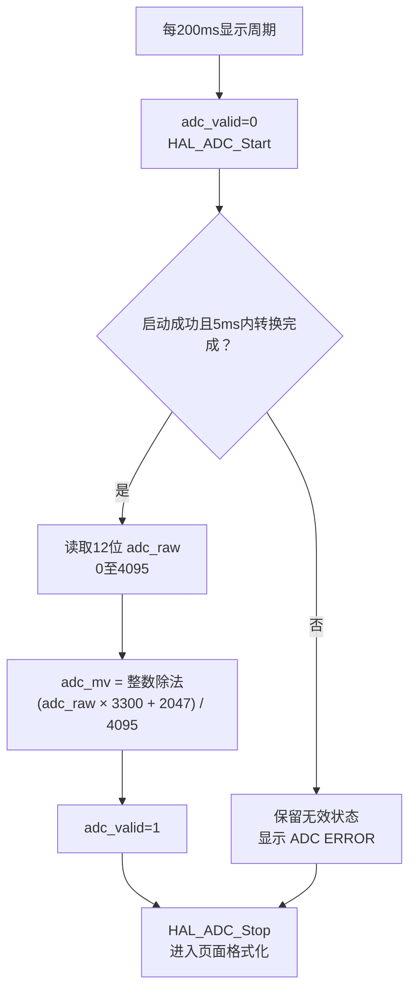

ADC1：PA1/channel 1，12 位右对齐，非连续、非扫描，软件触发，采样时间 144 cycles，ADC 时钟为 APB2/4=25MHz。公式中的 3300mV 是配置假设，没有动态测量 VREF。显示 PA1 电压及原码，不乘电池分压系数。没有多次平均或软件滤波。

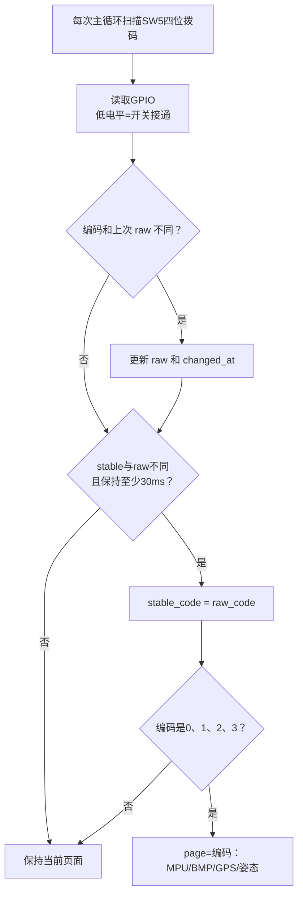

SWITCH1=PA6、SWITCH2=PA7、SWITCH3=PA8、SWITCH4=PB9，软件启用内部上拉，开关接通为低电平。四位编码为 `code = SW1 + 2×SW2 + 4×SW3 + 8×SW4`。`0000`、`0001`、`0010`、`0011` 分别选择 MPU、BMP/ADC、GPS、姿态；其他编码保持上一页。拨码编码连续稳定30ms后生效，不存在长按连翻逻辑。

页面顺序：0=MPU6050，1=BMP388/ADC，2=GPS，3=姿态。页面变化不影响所有传感器的持续轮询和 GPS 接收。

## 10. 显示数据组织与串口帧


| 页面 | 行号（从0开始） | 内容 |
| --- | --- | --- |
| MPU | 0 | `1/4 MPU6050` |
| MPU | 1–3 | AX、AY、AZ，单位 G，3位小数 |
| MPU | 4–6 | GX、GY、GZ，单位 D/S，2位小数 |
| MPU | 7 | 温度，单位 C，2位小数 |
| BMP/ADC | 0 | `2/4 BMP388 / ADC` |
| BMP/ADC | 2、3 | 压力 HPA、温度 C |
| BMP/ADC | 4、5、6、7 | 相对高度 H、ADC RAW、还原后的原电压 BAT、`DIV:10/43 ADC` |
| GPS | 0、1 | 页标题、FIX质量与SAT卫星数 |
| GPS | 2–5 | 经纬度格式标题、原始度分字符串和方向 |
| 姿态 | 0、2–4 | `4/4 ATTITUDE`、ROLL/PITCH/YAW，单位 DEG，2位小数 |
| 姿态 | 6–7 | 安装方向提示、航向为相对值提示 |

每次先清零全部行数组，因此缺省行变成空白，错误页不会残留本次未写入的旧行。`fixed()` 用整数绝对值、商、余数及符号格式化，不需要浮点 printf。

### 固定 173 字节协议

| 字节偏移 | 字节数 | 含义 |
| --- | --- | --- |
| 0 | 1 | ASCII `Q`，0x51 |
| 1 | 1 | ASCII `D`，0x44 |
| 2 | 1 | 版本，0x01 |
| 3–170 | 168 | 8行×21列 ASCII，按行排列，无换行和字符串终止符 |
| 171 | 1 | CRC低字节 |
| 172 | 1 | CRC高字节 |

第 r 行第 c 列的位置是 `3 + r×21 + c`。CRC16-CCITT-FALSE：初值 `0xFFFF`、多项式 `0x1021`、无输入/输出反射、无末尾异或；覆盖字节 0–170。每输入一字节，先异或到 CRC 高8位，再左移8次，移出最高位为1时异或多项式。

8N1 每字节含1起始位、8数据位、1停止位；173字节在115200 baud下的纯线路时间约为 `173×10/115200 = 15.02ms`。不含调用开销和异常等待。协议只带显示文字，没有原始数值结构、测量时间戳或采样序号。

## 11. ESP32 接收、校验和断流处理

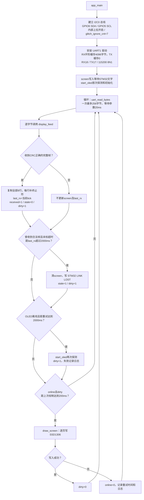

I²C 总线创建、UART 驱动安装/参数/引脚配置调用 `ESP_ERROR_CHECK`，失败会进入 ESP-IDF 致命错误处理，不走 OLED 的普通重试分支。显示任务是 `app_main` 内的循环，UART 底层接收由 ESP-IDF 驱动缓存，没有另外创建显示工作任务。

从未收到合法帧时一直显示 `WAIT STM32 DATA`；只有曾经收到后再断流，才显示 `STM32 LINK LOST`。CRC 错帧不会延长在线时间。同一次读取中若有多帧，后面的合法帧会覆盖前面的 screen，最终绘制最新一帧。

### 接收帧重新同步

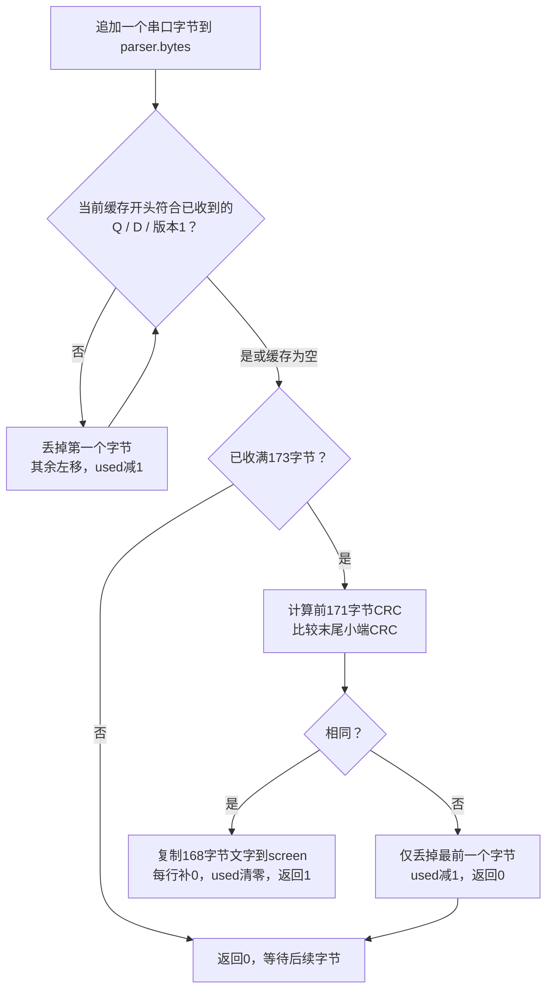

CRC 失败不是清空全部缓存，而是滑动一个字节；下次输入继续寻找帧头，能恢复截断、插入噪声和错位。解析器没有单独的半帧接收超时。CRC提供错误检测，不提供加密或身份认证。

## 12. OLED 初始化与逐页点阵写入

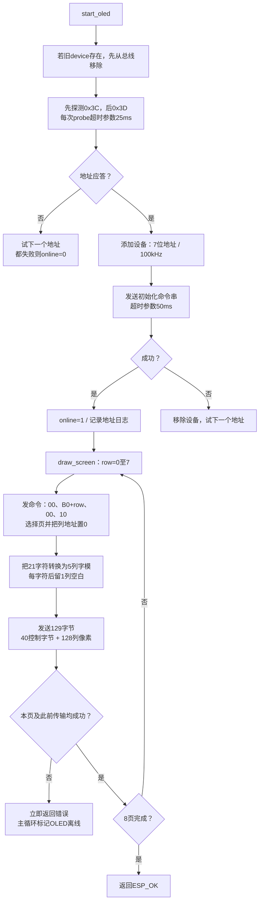

设备添加失败时直接返回离线；初始化命令发送失败时移除该设备并继续尝试后续地址。页定位命令失败也立即返回，不发送该页像素。

### 初始化发送的所有命令

最前面的 `0x00` 是 I²C 命令控制字节，不是 SSD1306 寄存器地址。后续顺序如下：

| 命令及参数 | 作用 |
| --- | --- |
| `AE` | 关闭显示 |
| `D5 80` | 显示时钟设置 |
| `A8 3F` | 64行复用 |
| `D3 00` | 显示偏移0 |
| `40` | 起始显示行0 |
| `8D 14` | 启用内部电荷泵 |
| `20 02` | 页寻址模式 |
| `A1` | 段地址映射方向 |
| `C8` | COM扫描方向 |
| `DA 12` | COM引脚布局 |
| `81 7F` | 对比度 |
| `D9 F1` | 预充电设置 |
| `DB 40` | VCOMH设置 |
| `A4` | 根据显存显示 |
| `A6` | 正常显示，不反色 |
| `2E` | 禁用滚动 |
| `AF` | 开启显示 |

### 文字变成像素的过程

```text
128×64 像素 → 8个页，每页8像素高、128列宽
每字符：5列字模 + 1列间隔 → 21字符占126列，最后2列空白
一个字模列用1字节表示，bit0在上、bit7在下
pixels[0] = 0x40                     // 数据控制字节
pixels[1 + 字符序号×6 + 字模列号] = glyph(字符, 字模列号)
其余pixels字节保持0                   // 字间距、行末空白
```

字体覆盖 `0–9`、`A–Z`、`- . : / +`，其他字符显示为空白，不支持中文。单页先发4字节命令，再发129字节数据；一屏共16次 I²C 写交易、1064字节控制/命令/像素负载，像素数据本身为1024字节。

加上每次交易的地址字节及 ACK，100kHz下纯位传输时间约 `(1064+16)×9/100000 = 97.2ms`，未计 START/STOP、驱动调度与异常等待。屏幕按页依次改写，没有双缓冲或垂直同步，逻辑上的整帧接收不等于屏幕硬件一次性刷新。当前没有差分刷新，dirty是“有新帧/新状态待画”，不是“字符内容确实不同”。

## 13. 手机 Wi-Fi 控制链与 F411 接收

```mermaid
flowchart LR
    A["手机浏览器<br/>双虚拟摇杆"] --> B["ESP32 SoftAP<br/>QUAD-CONTROL / 192.168.4.1"]
    B --> C["HTTP POST /api/control<br/>约50ms一次，严格校验0..4095"]
    C --> D["control_encode<br/>QCTRL v1 / CRC16"]
    D --> F["UART1<br/>ESP GPIO17 TX → F411 PA3 RX"]
    F --> G["USART2 RX 中断<br/>SensorApp_LinkIRQ"]
    G --> H["ControlApp_RxByte<br/>滑动同步 + CRC 校验"]
    H --> I["ControlApp_GetLatest<br/>最新轴量/250 ms 超时"]
    I --> J["MotorLogic<br/>解锁校验/同油门映射"]
    J --> K["TIM3 CH1-4<br/>50Hz / PB4 PB5 PB0 PB1"]
```

QCTRL v1 固定 20 字节：`51 43 01` 帧头、序号、YAW/THR/PITCH/ROLL 四个小端 16 位值、按键位、flags、电池电压字段、保留字节和 CRC16-CCITT。手机网页传四轴原码、OLED 页面与解锁请求；ESP32 将解锁请求放入 flags bit0，并填写序号与 CRC。HTTP 接收任务收到完整合法请求后立即经 UART 发给 F411，OLED 主循环只读取最新状态。网页停止发送时 ESP32 也不再发送 UART 控制帧；F411 中断只更新最新命令快照，主循环校验解锁条件并映射 1100–1940μs 同油门，TIM3 中断输出四路 50Hz。链路失效或主循环停滞超过 250ms 时回最低油门。当前无姿态混控，详见[电机说明](../MOTORS.md)。

## 14. 异常与恢复汇总

| 异常 | 立即动作 | 恢复路径 |
| --- | --- | --- |
| STM32 时钟、ADC、I²C/UART HAL初始化失败 | 关中断，停在 Error_Handler | 需要排查并复位 |
| MPU/BMP不存在、ID错误、配置失败 | ready=0，valid=0 | 主循环每2秒重试初始化 |
| MPU/BMP采样交易失败 | ready=0，valid=0，不显示旧测量值 | 同上 |
| MPU/BMP超过500ms无新数据 | 清ready/valid | 同上 |
| BMP补偿非有限数或超范围 | 清ready/valid | 同上 |
| GPS UART硬件错误或环形缓冲满 | 置gps_overflow | 主循环丢弃积压和半句，等待新的完整GGA |
| GPS校验/字段错误 | 不更新定位与时间戳 | 后续合法GGA覆盖；超3秒显示超时 |
| GPS合法GGA但quality=0 | 更新为无定位状态 | 有效定位GGA到来后显示坐标 |
| ADC启动或转换失败 | adc_valid=0 | 下一个200ms周期重采 |
| STM32显示串口发送失败 | 不检查返回值，不立即重传 | 下周期发最新完整帧，ESP接收器重新同步 |
| 显示帧错位或CRC错误 | 不改screen、不更新last_rx | 滑动查找下一合法帧 |
| ESP收到数据后断流超过2秒 | 清旧屏幕文字，显示链路断开 | 新合法帧自动恢复 |
| 手机 HTTP 指令超过250ms未更新 | 手机 OLED 页显示链路断开，ESP不产生新控制帧 | 网页恢复发送后更新；F411 自行按250ms超时判断 |
| OLED无应答或写失败 | online=0 | 每2秒探测并完整初始化 |

错误检测的时间点受主循环阻塞影响，上表时间都是程序判断阈值，而非严格的最长故障响应时间。

## 15. 图与代码的对应关系

| 内容 | 源文件与主要函数 |
| --- | --- |
| 复位、段初始化、向量表 | [GCC/startup_stm32f411xe.S](../GCC/startup_stm32f411xe.S) |
| 内存布局 | [GCC/stm32f411xe.ld](../GCC/stm32f411xe.ld)：512KiB Flash / 128KiB RAM，4KiB栈、2KiB堆 |
| 主函数、GPIO、ADC、时钟 | [Core/Src/main.c](../Core/Src/main.c) |
| 调度、传感器寄存器、拨码、页面 | [Core/Src/sensor_app.c](../Core/Src/sensor_app.c)：SensorApp_Init / SensorApp_Poll / send_screen |
| BMP系数及公式 | [Core/Src/bmp388_math.c](../Core/Src/bmp388_math.c) |
| GPS句子校验 | [Core/Src/gps_nmea.c](../Core/Src/gps_nmea.c)：Gps_ParseGga |
| GPS与SysTick中断入口 | [Core/Src/stm32f4xx_it.c](../Core/Src/stm32f4xx_it.c) |
| 两端共用显示协议 | [Common/display_link.h](../Common/display_link.h)：display_encode / display_feed / display_crc |
| 手机控制协议 | [Common/control_link.h](../Common/control_link.h)：control_encode / control_feed / control_decode |
| F411 控制帧接收 | [Core/Src/control_app.c](../Core/Src/control_app.c)：ControlApp_RxByte / ControlApp_GetLatest |
| ESP32接收和OLED | [esp32_oled/main/oled_main.c](../esp32_oled/main/oled_main.c)：app_main / start_oled / draw_screen / glyph |
| ESP32热点/网页 | [esp32_oled/main/phone_server.c](../esp32_oled/main/phone_server.c)、[esp32_oled/main/phone_control.html](../esp32_oled/main/phone_control.html) |
| STM32配置常量 | [Core/Inc/sensor_config.h](../Core/Inc/sensor_config.h) |
| ESP32默认参数 | [esp32_oled/main/Kconfig.projbuild](../esp32_oled/main/Kconfig.projbuild)，实际构建以sdkconfig为准 |

以上描述的是当前代码行为，不代表所有分支已完成硬件验证。后续若修改寄存器、调度或帧版本，应同步更新本文件。
